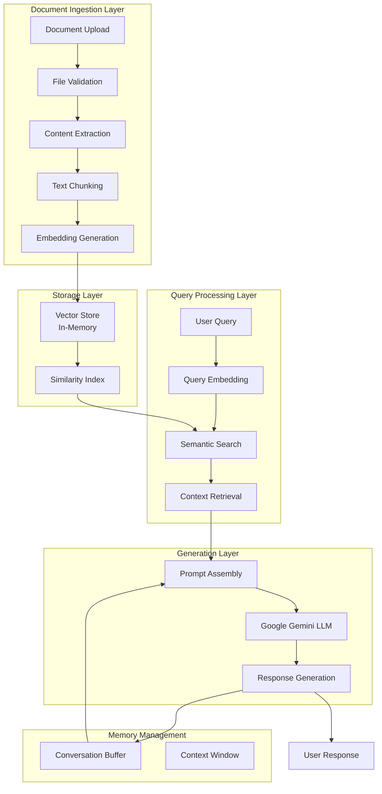

# RAG Agent Architecture Documentation 🏗️

## System Architecture Overview



## Component Interaction Flow

### 1. Document Processing Pipeline

```
┌─────────────┐    ┌─────────────┐    ┌─────────────┐    ┌─────────────┐
│   PDF/CSV   │───▶│   Parser    │───▶│   Chunker   │───▶│  Embedder   │
│   Upload    │    │  Extractor  │    │  (1000 chr) │    │  (Gemini)   │
└─────────────┘    └─────────────┘    └─────────────┘    └─────────────┘
                                             │                    │
                                             ▼                    ▼
                                    ┌─────────────┐    ┌─────────────┐
                                    │   Overlap   │    │   Vector    │
                                    │  Strategy   │    │   Store     │
                                    │  (200 chr)  │    │ (In-Memory) │
                                    └─────────────┘    └─────────────┘
```

### 2. Query-Response Cycle

```
User Query ──┐
             │
             ▼
    ┌─────────────────┐
    │ Query Embedding │
    └─────────────────┘
             │
             ▼
    ┌─────────────────┐     ┌─────────────────┐
    │ Semantic Search │────▶│ Top-K Retrieval │
    └─────────────────┘     └─────────────────┘
             │                       │
             ▼                       ▼
    ┌─────────────────┐     ┌─────────────────┐
    │ Context Assembly│◀────│ Relevance Score │
    └─────────────────┘     └─────────────────┘
             │
             ▼
    ┌─────────────────┐     ┌─────────────────┐
    │ Prompt Template │────▶│ Google Gemini   │
    └─────────────────┘     └─────────────────┘
             │                       │
             ▼                       ▼
    ┌─────────────────┐     ┌─────────────────┐
    │ Memory Update   │◀────│ Response Gen.   │
    └─────────────────┘     └─────────────────┘
```

## Node Configuration Details

### 1. Document Upload Node
```yaml
Node Type: Form Trigger
Configuration:
  - File Types: PDF, CSV
  - Max Size: 10MB
  - Validation: MIME type checking
  - Output: Binary data stream
```

### 2. Document Loader Node
```yaml
Node Type: Default Data Loader
Configuration:
  - Input: Binary data
  - Processing: Text extraction
  - Output: Document chunks
  - Error Handling: Format validation
```

### 3. Vector Store Node (Insert Mode)
```yaml
Node Type: In-Memory Vector Store
Configuration:
  - Mode: Insert
  - Memory Key: vector_store_key
  - Embedding Model: Google Gemini
  - Index Type: Flat (FAISS)
```

### 4. Vector Store Node (Retrieve Mode)
```yaml
Node Type: In-Memory Vector Store
Configuration:
  - Mode: Retrieve as Tool
  - Tool Name: knowledge_base
  - Memory Key: vector_store_key
  - Top-K: 5 documents
  - Similarity Threshold: 0.7
```

### 5. Chat Trigger Node
```yaml
Node Type: Chat Trigger
Configuration:
  - Webhook URL: Auto-generated
  - Input Format: JSON
  - Session Management: Enabled
  - Rate Limiting: 100 req/min
```

### 6. AI Agent Node
```yaml
Node Type: LangChain Agent
Configuration:
  - Agent Type: Conversational
  - Tools: [knowledge_base]
  - Memory: Buffer Window
  - Max Iterations: 5
```

### 7. Google Gemini Chat Model
```yaml
Node Type: Google Gemini LLM
Configuration:
  - Model: gemini-pro
  - Temperature: 0.7
  - Max Tokens: 2048
  - Top P: 0.9
  - Credentials: Google PaLM API
```

### 8. Memory Buffer Node
```yaml
Node Type: Buffer Window Memory
Configuration:
  - Window Size: 10 exchanges
  - Memory Key: chat_history
  - Return Messages: True
  - Input Key: input
  - Output Key: output
```

## Data Flow Specifications

### Document Processing Flow
```
Input: PDF/CSV File (max 10MB)
  ↓
Content Extraction
  ↓ 
Text Chunking (1000 chars, 200 overlap)
  ↓
Embedding Generation (768 dimensions)
  ↓
Vector Storage (In-Memory FAISS)
  ↓
Index Creation (Cosine Similarity)
```

### Query Processing Flow
```
Input: User Query (Text)
  ↓
Query Embedding (768 dimensions)
  ↓
Similarity Search (Cosine Distance)
  ↓
Top-K Retrieval (K=5)
  ↓
Context Assembly (Ranked by relevance)
  ↓
Prompt Construction (System + Context + Query)
  ↓
LLM Generation (Google Gemini)
  ↓
Response Post-processing
  ↓
Output: Contextual Response
```

## Memory Architecture

### Conversation Memory Structure
```
Buffer Window Memory:
├── Exchange 1: {user: "...", assistant: "..."}
├── Exchange 2: {user: "...", assistant: "..."}
├── ...
└── Exchange N: {user: "...", assistant: "..."}
                 ↑
            Current Context Window (10 exchanges)
```

### Vector Memory Structure
```
Vector Store:
├── Document 1:
│   ├── Chunk 1: [embedding_vector_768d]
│   ├── Chunk 2: [embedding_vector_768d]
│   └── ...
├── Document 2:
│   ├── Chunk 1: [embedding_vector_768d]
│   └── ...
└── Similarity Index: FAISS Flat Index
```

## Performance Characteristics

### Latency Breakdown
```
Total Response Time: ~2-5 seconds
├── Query Embedding: ~200ms
├── Vector Search: ~100ms
├── Context Assembly: ~50ms
├── LLM Generation: ~1-3s
└── Response Processing: ~50ms
```

### Memory Usage
```
Base Memory: ~100MB (n8n runtime)
├── Vector Store: ~10MB per 1000 chunks
├── Embeddings Cache: ~5MB per document
├── Conversation Buffer: ~1MB per session
└── Model Cache: ~50MB (Google Gemini client)
```

### Scalability Limits
```
Current Architecture Limits:
├── Documents: ~100 files (10MB each)
├── Concurrent Users: ~10 sessions
├── Vector Dimensions: 768 (fixed)
├── Memory Capacity: ~2GB RAM
└── API Rate Limits: Google Gemini quotas
```

## Security Architecture

### Data Flow Security
```
User Input ──[HTTPS]──▶ n8n Webhook ──[Validation]──▶ Processing
                                           │
                                           ▼
Document Store ◀──[In-Memory]──── Vector Embeddings
     │                                     │
     ▼                                     ▼
Temporary Storage ──[Auto-Cleanup]──▶ Google Gemini API
                                      [Encrypted Transit]
```

### Access Control
```
Security Layers:
├── Webhook Authentication (Optional)
├── API Key Management (Google Gemini)
├── Input Validation (File types, sizes)
├── Output Sanitization (Response filtering)
└── Memory Isolation (Session-based)
```

## Monitoring and Observability

### Key Metrics
```yaml
Performance Metrics:
  - Query Response Time (P50, P95, P99)
  - Vector Search Latency
  - LLM Generation Time
  - Memory Usage Trends

Quality Metrics:
  - Retrieval Accuracy (Precision@K)
  - Response Relevance Scores
  - User Satisfaction (if feedback enabled)
  - Error Rates by Component

Resource Metrics:
  - API Usage (Tokens/hour)
  - Memory Consumption
  - CPU Utilization
  - Network Bandwidth
```

### Logging Strategy
```yaml
Log Levels:
  - ERROR: System failures, API errors
  - WARN: Performance degradation, rate limits
  - INFO: User interactions, document uploads
  - DEBUG: Detailed execution traces

Log Destinations:
  - n8n Execution Logs
  - Console Output
  - File System (optional)
  - External Monitoring (optional)
```

This architecture documentation provides a comprehensive view of the RAG agent's technical implementation, data flows, and system characteristics.